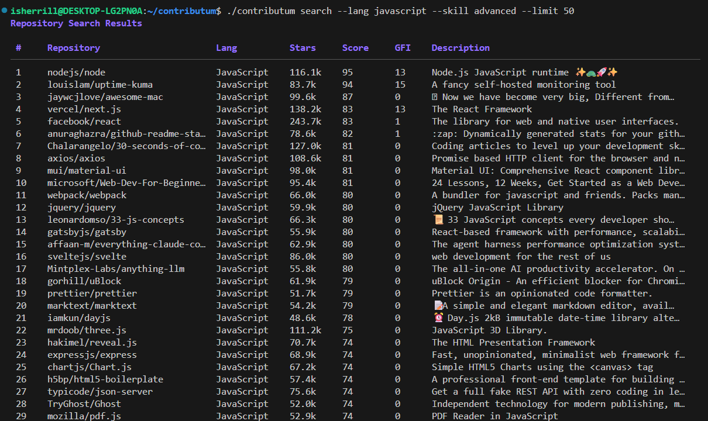

# Contributum

[](https://github.com/ijshd7/contributum/actions/workflows/ci.yml)
[](https://github.com/ijshd7/contributum/releases)

Find open-source repositories to contribute to, right from your terminal.

Contributum searches GitHub for projects that match your language preferences, topics of interest, and skill level. It scores repositories by activity, contribution-friendliness, and relevance to help you find the best places to start contributing.

## Features

- **Repository Search** — Find repos by language, topic, and skill level
- **Issue Discovery** — Find "good first issue" and "help wanted" issues across GitHub
- **Smart Scoring** — Repos are ranked by activity, contribution-friendliness, and relevance
- **Skill-Based Filtering** — Beginner, intermediate, and advanced modes adjust scoring weights
- **Styled Output** — Beautiful terminal tables with colored scores
- **JSON Export** — Machine-readable output for scripting and integrations

## Installation

### From Source

```sh
git clone https://github.com/ijshd7/contributum.git
cd contributum
go build -o contributum .
```

### Go Install

```sh
go install github.com/ijshd7/contributum@latest
```

## Quick Start

```sh
# Find beginner-friendly Go CLI projects
contributum search --lang go --topic cli --skill beginner

# Search for Python web projects with at least 100 stars
contributum search --lang python --topic web --min-stars 100

# Find "good first issue" issues in Rust projects
contributum issues --lang rust

# Output results as JSON
contributum search --lang javascript --json
```

## Demo



## Authentication

Contributum uses the GitHub Search API. Without authentication, you're limited to **10 search requests per minute**. With a token, you get **30 requests per minute**.

1. Create a [GitHub Personal Access Token](https://github.com/settings/tokens) (no special scopes needed for public repo search)
2. Copy `.env.example` to `.env` and add your token:

```sh
cp .env.example .env
# Edit .env and replace the placeholder with your token
```

Or set the environment variable directly:

```sh
export GITHUB_TOKEN=your_token_here
```

## Commands

### `search`

Search for repositories to contribute to.

| Flag | Short | Default | Description |
|------|-------|---------|-------------|
| `--lang` | `-l` | (required) | Languages to search for (comma-separated) |
| `--topic` | `-t` | | Topics to match (comma-separated) |
| `--skill` | `-s` | `intermediate` | Skill level: `beginner`, `intermediate`, `advanced` |
| `--min-stars` | | `0` | Minimum star count |
| `--limit` | | `10` | Maximum number of results |
| `--json` | | `false` | Output as JSON |

### `issues`

Find open issues to contribute to.

| Flag | Short | Default | Description |
|------|-------|---------|-------------|
| `--lang` | `-l` | (required) | Languages to search for (comma-separated) |
| `--label` | | `good first issue` | Issue labels to filter by (comma-separated) |
| `--limit` | | `10` | Maximum number of results |
| `--json` | | `false` | Output as JSON |

### `version`

Print the version of contributum.

## Scoring

Repositories are scored on a 0-100 scale across three dimensions:

| Dimension | Weight | What It Measures |
|-----------|--------|------------------|
| **Activity** | 40% | Stars, forks, and how recently the project was updated |
| **Friendliness** | 35% | Count of "good first issue" / "help wanted" labels, presence of CONTRIBUTING.md |
| **Relevance** | 25% | Language and topic match against your search criteria |

Skill level adjusts these weights:

- **Beginner**: Friendliness weighted at 50%, filters out repos without good-first-issues
- **Intermediate**: Default balanced weights
- **Advanced**: Activity weighted at 55%, focuses on highly active projects

## Contributing

Contributions are welcome! Feel free to open issues or submit pull requests.

## License

[MIT](LICENSE)
